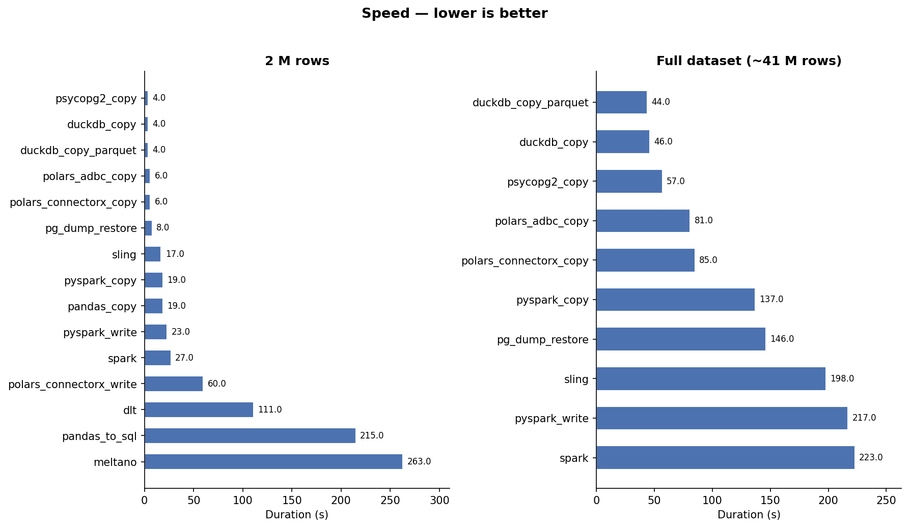
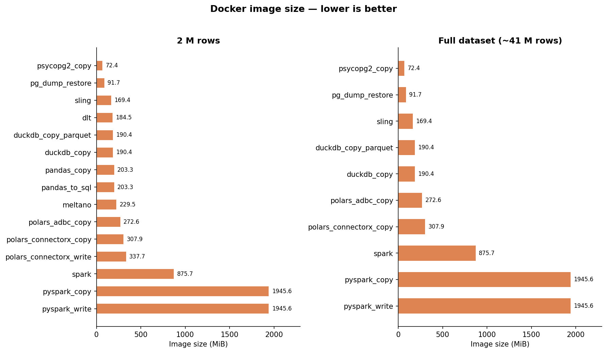
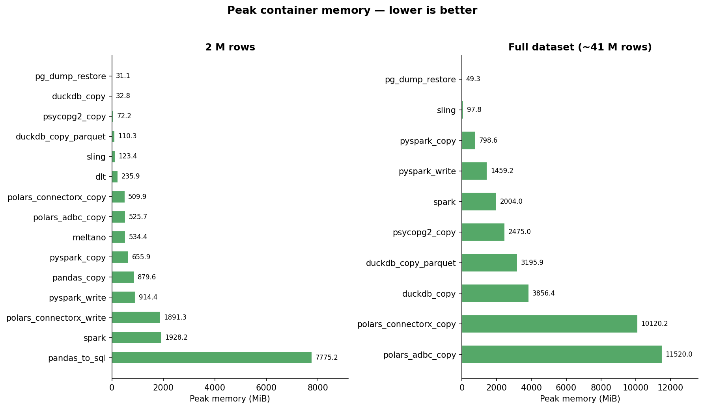
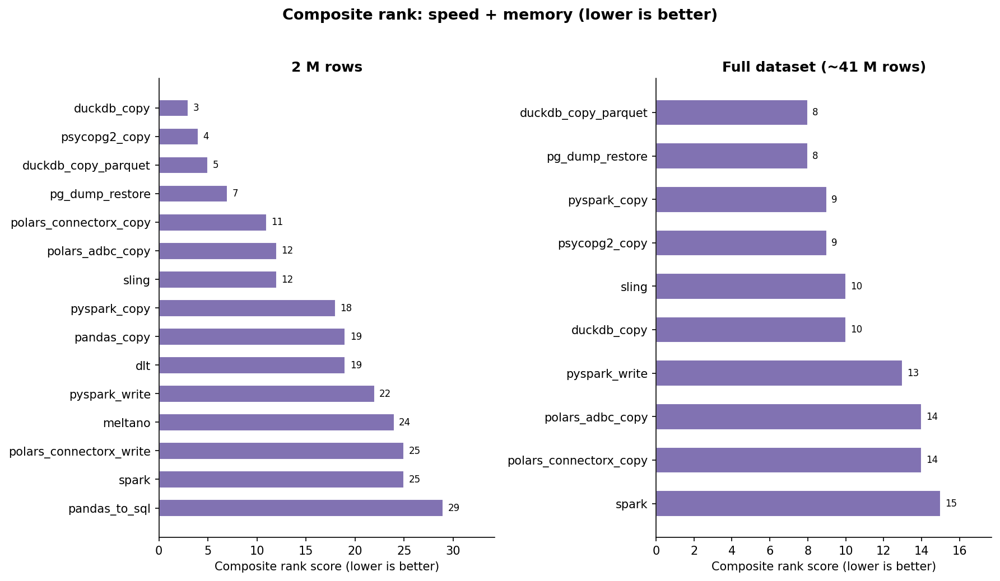

# ETL — Batch Migration Benchmark

This project benchmarks **batch data migration** tools: each method reads a full static dataset from a source PostgreSQL database, writes it to a target PostgreSQL database in a single run, and is measured on duration and peak memory. It does **not** benchmark streaming, CDC, or incremental replication tools — those operate on a fundamentally different model (continuous operation, event-by-event latency, replication lag) that cannot be fairly compared with a one-shot bulk transfer.

# Data

OS Open UPRN
https://osdatahub.os.uk/downloads/open/OpenUPRN

full count: 41,011,955
test count: 2,000,000

# Highlights

> **Code easiness** is rated 1–5 (5 = simplest, no boilerplate): how much code and configuration a developer needs to write to get a working migration.
> **Checkpoint** indicates whether the tool can resume a partial transfer after a failure without restarting from row 0.

## psycopg2 COPY (`psycopg2_copy`)
- Fastest method overall alongside DuckDB — streams binary COPY directly between source and target with zero serialisation overhead.
- Lowest image size (72 MiB) and very low memory footprint.
- No transformation, schema management, or error recovery built in.
- **Checkpoint:** ✗ — single binary stream; must restart from scratch on failure.
- **Code easiness:** 3/5 — raw SQL and `copy_expert` calls; requires understanding of binary COPY protocol; no abstraction layer.

## pg_dump/pg_restore (`pg_dump_restore`)
- Best choice for PostgreSQL-to-PostgreSQL migrations that don't require transformation.
- Preserves indexes, constraints, and sequences out of the box.
- Very low memory usage; delegates all work to the PostgreSQL engine.
- Cannot run any transformation logic on the data.
- **Checkpoint:** ✗ — pg_restore can be re-run but restarts fully; no row-level resume.
- **Code easiness:** 5/5 — a two-line shell script; no programming required.

## DuckDB (`duckdb_copy`, `duckdb_copy_parquet`)
- Joint fastest method for both small and large datasets.
- SQL-based: great for teams already comfortable with SQL; supports transforms, filters, and joins inline.
- Not distributed — single process, so throughput is bounded by one machine's I/O and memory.
- Parquet variant produces a reusable intermediate file useful for auditing or multi-target loads.
- **Checkpoint:** ✗ — single DuckDB transaction; no built-in row-level resume.
- **Code easiness:** 5/5 — a handful of SQL statements; the entire pipeline is one script.

## Sling (`sling`)
- Purpose-built replication tool with many built-in features: retries, streaming, schema mapping, and incremental modes.
- Very low memory footprint despite processing the full dataset.
- Slower than binary-COPY methods because it uses text-mode row-by-row replication internally.
- Supports dozens of sources and targets beyond PostgreSQL with minimal config changes.
- **Checkpoint:** ✓ — supports incremental replication and can resume from a watermark column (`updated_at`, primary key, etc.).
- **Code easiness:** 5/5 — a single YAML/shell config; no programming required.

## Meltano (`meltano`)
- Singer-based EL platform; tap-postgres + target-postgres handles schema discovery automatically.
- Slowest method tested — Singer's JSON-lines message format at the protocol level adds significant overhead.
- Best suited for production pipelines where the ecosystem (250+ connectors, orchestration, CI) matters more than raw speed.
- **Checkpoint:** ✓ — Singer STATE messages provide row-level bookmarks; Meltano persists and resumes from the last state.
- **Code easiness:** 3/5 — requires `meltano.yml` plugin config and understanding of Singer tap/target conventions.

## dlt (`dlt`)
- Python-native EL library with automatic schema inference, type coercion, and version management.
- Adds `_dlt_id` and `_dlt_load_id` metadata columns to the target table automatically.
- Moderate speed; overhead comes from schema management and chunk-based loading.
- Good fit for pipelines that need schema evolution, lineage tracking, or multi-destination fan-out.
- **Checkpoint:** ✓ — pipeline state is persisted; a failed run can be resumed from the last successfully loaded batch.
- **Code easiness:** 4/5 — a ~30-line Python script using a high-level API; schema and connection handling are automatic.

## Pandas (`pandas_copy`, `pandas_to_sql`)
- `pandas_copy` uses `read_sql` + `COPY` bulk load: fast and familiar for data scientists.
- `pandas_to_sql` uses `to_sql()` with SQLAlchemy: very simple code but row-by-row inserts make it extremely slow and RAM-hungry (7+ GiB for 2 M rows).
- Pandas loads the entire dataset into memory; unsuitable for datasets larger than available RAM.
- Best for smaller datasets or prototyping where the team already knows pandas.
- **Checkpoint:** ✗ — no built-in resume; full reload on failure.
- **Code easiness:** 5/5 (`pandas_copy`) / 5/5 (`pandas_to_sql`) — standard pandas API, minimal boilerplate.

## Polars (`polars_adbc_copy`, `polars_connectorx_copy`, `polars_connectorx_write`)
- `polars_adbc_copy` and `polars_connectorx_copy` use bulk COPY loading — fast and memory-efficient compared to `pandas_copy`.
- `polars_connectorx_write` uses `write_database()`: correct but extremely memory-hungry (~1.9 GiB for 2 M rows) because it buffers all rows.
- ConnectorX reads from PostgreSQL in parallel chunks, making source reads faster than psycopg2 for large tables.
- Very similar API to pandas but with Rust-backed columnar processing — a drop-in upgrade for larger datasets.
- **Checkpoint:** ✗ — no built-in resume; full reload on failure.
- **Code easiness:** 4/5 — nearly identical to pandas; one extra line for the COPY sink.

## PySpark (`pyspark_copy`, `pyspark_write`)
- `pyspark_copy` uses JDBC read + CSV intermediate + COPY: reasonable speed, moderate memory.
- `pyspark_write` uses JDBC read + JDBC write: slow due to row-at-a-time JDBC inserts.
- Both variants require a JVM + Spark cluster overhead even on a single node — large image (~1.9 GiB).
- Overkill for single-table migration; shines when the pipeline is part of a broader Spark ecosystem (Delta Lake, MLlib, etc.).
- **Checkpoint:** ✓ — Spark's RDD/Dataset lineage allows re-computation of failed partitions; `pyspark_copy` can checkpoint mid-stream.
- **Code easiness:** 2/5 — requires SparkSession setup, schema definition, and JDBC tuning (numPartitions, fetchsize, batchsize).

## Spark Scala (`spark`)
- Same Spark engine as PySpark but written in Scala: slightly lower overhead and stronger type safety.
- Requires `sbt` build toolchain; longer initial compile time adds to setup complexity.
- Similar speed profile to `pyspark_write` — JDBC write is the bottleneck.
- **Checkpoint:** ✓ — same Spark partition-level fault tolerance as PySpark.
- **Code easiness:** 1/5 — requires Scala, sbt, and Spark API knowledge; most complex setup in the benchmark.

# Conclusion

## Small datasets (~2 M rows)

- **Use `duckdb_copy`** — best overall balance of speed (4s), memory (33 MiB), and simplicity. Pure SQL, no ORM.
- **Use `pg_dump_restore`** — absolute lowest memory (31 MiB), zero code, perfect fidelity. Best for ops workflows.
- **Use `psycopg2_copy`** — fastest pure-Python option (4s, 72 MiB), no ORM or extra dependencies.
- **Use `sling`** if you need checkpointing / incremental loads — simplest tool with built-in resume support.
- **Use `dlt`** if you need checkpointing with automatic schema evolution managed in Python.
- **Use `meltano`** if you need checkpointing and are already in the Singer ecosystem (250+ connectors).
- **Avoid `pandas_to_sql`** — 55× slower than `psycopg2_copy` and uses 100× more RAM; `pandas_copy` is a straightforward drop-in improvement.

## Large datasets (~41 M rows)

At full scale, several methods fail or time out, and the rankings shift substantially:

| Method | Duration | Peak RAM | Result |
|--------|----------|----------|--------|
| `duckdb_copy` | 46s | 3.9 GiB | ✓ PASS |
| `duckdb_copy_parquet` | 44s | 3.2 GiB | ✓ PASS |
| `psycopg2_copy` | 57s | 2.5 GiB | ✓ PASS |
| `polars_adbc_copy` | 81s | 11.5 GiB | ✓ PASS |
| `polars_connectorx_copy` | 85s | 10.1 GiB | ✓ PASS |
| `pyspark_copy` | 137s | 0.8 GiB | ✓ PASS |
| `pg_dump_restore` | 146s | 49 MiB | ✓ PASS |
| `sling` | 198s | 98 MiB | ✓ PASS |
| `spark` | 223s | 2.0 GiB | ✓ PASS |
| `pyspark_write` | 217s | 1.5 GiB | ✓ PASS |
| `pandas_copy` | —  | 14.7 GiB | ✗ Timeout |
| `polars_connectorx_write` | — | 14.8 GiB | ✗ Count mismatch |
| `pandas_to_sql` | — | 14.8 GiB | ✗ OOM crash |
| `meltano` | — | 611 MiB | ✗ Timeout |
| `dlt` | — | 176 MiB | ✗ Timeout |

**Key takeaways at scale:**

- **`sling` becomes the standout choice** when memory is constrained — only 98 MiB at 41 M rows, the lowest of any passing method by far. Sling streams rows rather than loading them into memory.
- **`pg_dump_restore`** remains the most memory-efficient option that also needs zero code, using just 49 MiB regardless of dataset size.
- **`psycopg2_copy`** is still the fastest pure-Python solution (57s) and stays well within memory bounds.
- **DuckDB** is the fastest overall (44–46s) but now requires 3–4 GiB RAM — viable on most machines but no longer "free".
- **PySpark earns its place at scale** — at 2M rows it looked like overkill; at 41M rows it is competitive (137s) and uses only 800 MiB RAM thanks to partition-based processing.
- **Polars ADBC/ConnectorX** work but require 10–11 GiB RAM — a hard constraint many machines won't meet.
- **Avoid Pandas entirely for large data** — both variants either crash or time out.
- **`dlt` and `meltano` time out** with the default 600s limit; they would likely pass with a higher timeout but are not suitable for large one-shot batch loads without tuning.

# Not Included

## PySpark Structured Streaming
Spark Structured Streaming requires a continuous or incremental source (Kafka, S3 file drops, Delta Lake change feed, etc.) — a static PostgreSQL table is not a streaming source. Using `Trigger.Once()` / `Trigger.AvailableNow()` over JDBC would behave identically to the existing `pyspark_copy` / `pyspark_write` batch jobs with added overhead and no meaningful differentiation. PySpark streaming is better evaluated in a CDC pipeline (e.g. PostgreSQL logical replication → Debezium → Kafka → Spark), which is a separate architecture from what this benchmark tests.

## Airbyte
Airbyte is designed to run as an independent long-lived server with a UI and orchestration layer. `pyairbyte` is a thin SDK wrapper, not a lightweight replacement for the server, and cannot replicate the same execution model. Adding Airbyte would require running a full Airbyte Platform deployment alongside the benchmark databases, which is out of scope for a single-container ETL comparison.

## Debezium
Debezium is a CDC (Change Data Capture) platform that tails PostgreSQL's write-ahead log (WAL) via logical replication and publishes every change as an event to Kafka. It is a continuous streaming infrastructure component, not a batch transfer tool. While it performs an initial snapshot of an existing table, it has no concept of "done" — it runs indefinitely waiting for further changes. Benchmarking it here would measure platform startup and scheduling overhead, not data transfer throughput. Debezium belongs in a separate CDC benchmark measuring replication lag and event throughput against a source generating continuous changes.

## PostgreSQL Logical Replication
PostgreSQL logical replication streams WAL changes continuously from a publisher to one or more subscribers. Like Debezium (which uses it internally), it is a perpetual streaming mechanism designed for keeping replicas in sync — not for one-shot bulk migrations. It requires `wal_level=logical` on the source, a replication slot, and a publication/subscription pair, and has no natural completion point for a fixed dataset. It is out of scope for a batch migration benchmark.

# Setup

This project provides multiple ways to set up the databases:

## Option 1: Local Development with Docker Compose (Recommended)

The easiest way to get started is using Docker Compose for local development:

### Quick Start

```bash
# Install dependencies (includes invoke)
uv sync

# Complete setup: start databases, seed data, and generate .env
uv run invoke setup-local

# Or run the script directly
python setup_local.py
```

This will:
- Start two PostgreSQL databases (source on port 5434, target on port 5433)
- Create the required table schemas
- Seed data from CSV if available in `data/osopenuprn_*.csv`
- Generate a centralised `.env` file with all connection variables

## Option 2: AWS Deployment with Terraform

For production or cloud-based testing, use Terraform to deploy Aurora PostgreSQL Serverless:

```bash
uv run invoke terraform-init

# Configure variables (copy and edit the example file)
cp terraform/terraform.tfvars.example terraform/terraform.tfvars
# Edit terraform.tfvars with your AWS VPC and subnet IDs

uv run invoke terraform-apply
```

## Option 3: Manual Local Setup

If you have an existing PostgreSQL installation:

```bash
createdb postgres   # source database
createdb target     # target database
psql -d postgres -f data/table_definitions.sql
psql -d target -f data/table_definitions.sql
python data/initial_upload.py
```

## Prerequisites

- **Python** >= 3.12 with [uv](https://docs.astral.sh/uv/) (manages dependencies — includes `psycopg2-binary`, no system Postgres client needed)
- **For Docker Setup**: Docker and Docker Compose
- **For Terraform**: Terraform >= 1.0, AWS CLI
- **For Manual Setup**: PostgreSQL >= 12 server (client tools not required)

Check dependencies:
```bash
uv run invoke check-deps
```

# Running Benchmarks

All benchmarks are managed centrally. Each subfolder contains an ETL implementation with its own Dockerfile. The centralised runner builds images, runs containers, monitors memory, validates source/target row counts, and generates a text report.

## Run All Benchmarks

```bash
# Full dataset (default)
uv run invoke test-all

# 2 million row subset
uv run invoke test-all --dataset 2m
```

## Run a Specific Benchmark

```bash
uv run invoke test-etl --etl duckdb_copy
uv run invoke test-etl --etl duckdb_copy --dataset 2m
```

## Build All Docker Images (without running)

```bash
uv run invoke build-all
```

## Stop and Clean Local Databases

```bash
# Stop databases (preserves data)
uv run invoke stop-local

# Stop and remove databases and all data volumes
uv run invoke clean-local
```

## List All Available Tasks

```bash
uv run invoke --list
```

## Available ETL Methods

Composite rank (2 M rows) = rank by duration + rank by peak memory. Lower is better.

| Rank (2M) | Method | Description | Checkpoint | Code Easiness |
|:---------:|--------|-------------|:----------:|:-------------:|
| 3 | `duckdb_copy` | DuckDB with CSV intermediate | ✗ | 5/5 |
| 4 | `psycopg2_copy` | Pure psycopg2 binary COPY source → COPY target (no ORM) | ✗ | 3/5 |
| 5 | `duckdb_copy_parquet` | DuckDB with Parquet intermediate | ✗ | 5/5 |
| 7 | `pg_dump_restore` | Native pg_dump/pg_restore | ✗ | 5/5 |
| 11 | `polars_connectorx_copy` | Polars ConnectorX + COPY bulk load | ✗ | 4/5 |
| 12 | `polars_adbc_copy` | Polars ADBC + COPY bulk load | ✗ | 4/5 |
| 12 | `sling` | Sling full-refresh replication | ✓ | 5/5 |
| 18 | `pyspark_copy` | PySpark JDBC read + CSV + COPY | ✓ | 2/5 |
| 19 | `pandas_copy` | Pandas read_sql + COPY bulk load | ✗ | 5/5 |
| 19 | `dlt` | dlt sql_database source + postgres destination | ✓ | 4/5 |
| 22 | `pyspark_write` | PySpark JDBC read + JDBC write | ✓ | 2/5 |
| 24 | `meltano` | Meltano EL with tap-postgres + target-postgres | ✓ | 3/5 |
| 25 | `polars_connectorx_write` | Polars ConnectorX + write_database | ✗ | 4/5 |
| 25 | `spark` | Scala Spark JDBC read + JDBC write | ✓ | 1/5 |
| 29 | `pandas_to_sql` | Pandas read_sql + to_sql() | ✗ | 5/5 |

## Benchmark Report

After running benchmarks, a `benchmark_report.txt` file is generated with:
- Duration for each test
- Peak memory usage
- Source and target row counts
- Pass/fail validation (source count must equal target count)

# Database Reference

## Local Connection Details

| | Source | Target |
|---|---|---|
| Host | `localhost` | `localhost` |
| Port | `5434` | `5433` |
| Database | `postgres` | `target` |
| User | `postgres` | `postgres` |
| Password | `postgres` | `postgres` |

Verify connectivity:
```bash
PGPASSWORD=postgres psql -h localhost -p 5434 -U postgres -d postgres -c "SELECT version();"
PGPASSWORD=postgres psql -h localhost -p 5433 -U postgres -d target -c "SELECT version();"
```

## Table Schema

```sql
CREATE TABLE os_open_uprn (
    uprn BIGINT NOT NULL,
    x_coordinate FLOAT8 NOT NULL,
    y_coordinate FLOAT8 NOT NULL,
    latitude FLOAT8 NOT NULL,
    longitude FLOAT8 NOT NULL
);
```

`os_open_uprn_2m` is pre-built at setup time as a 2,000,000-row subset of `os_open_uprn`.

## AWS Seeding

After `uv run invoke terraform-apply`, seed the remote database:

```bash
DB_ENDPOINT=$(cd terraform && terraform output -raw cluster_endpoint)
DB_USER=$(cd terraform && terraform output -raw master_username)
DB_PASSWORD=$(cd terraform && terraform output -raw master_password)

cd terraform && uv run python seed-database.py
```

Then set your `.env` to point at the AWS cluster:
```bash
ORIGIN_ADDRESS=<cluster_endpoint>
ORIGIN_DB=source
ORIGIN_USER=<master_username>
ORIGIN_PASS=<master_password>
TARGET_ADDRESS=<cluster_endpoint>
TARGET_DB=target
TARGET_USER=<master_username>
TARGET_PASS=<master_password>
```

# Results

Charts are generated from `benchmark_report.csv` (best passing run per method × dataset).

Regenerate after running benchmarks:
```bash
uv run python plot_results.py
```

## Speed (Duration)



## Image Size



## Peak Memory



## Composite Rank (Speed + Memory)

